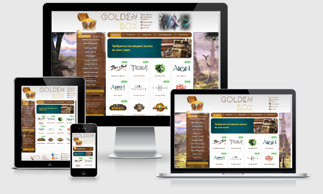
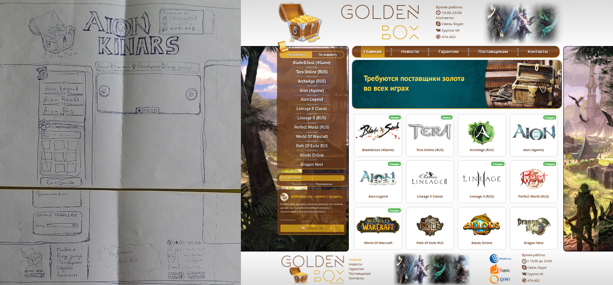
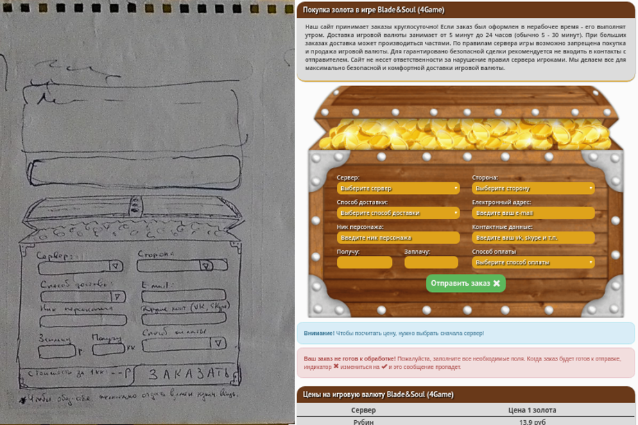

   

## My first job for goldenbox.org, with use AngularJS and Bootstrap.
>Demo: https://yarik-vv.github.io/goldenbox.org/

This is responsive, cross-browser SPA (single page application) which uses AngularJS 1.X (2 controllers and 1 service) and Bootstrap, data come from a JSON file by AJAX request.

## Usage:
`$ npm start` - run server listening on http://localhost:3000
> Production version in gh-pages branch! 

## Layout --> Result:

